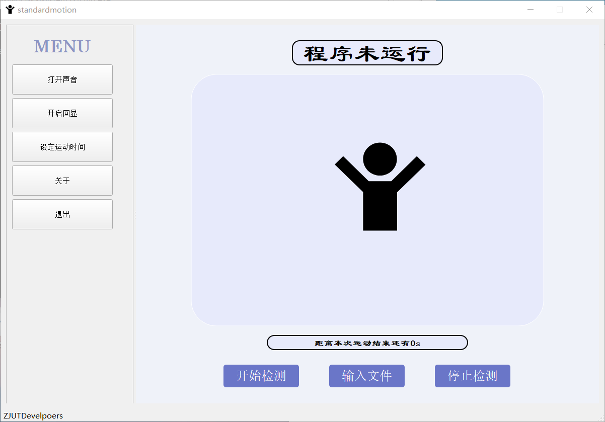

# StandardMotion

[](https://github.com/ZJUTDevelopers/standardmotion)

## About The Project

This project is used to detect movement and judge whether the movement time is up to standard.




## Getting Started

### Prerequisites

This project uses [Python](https://www.python.org/) (v3.6 or higher)  and [openpose](https://github.com/CMU-Perceptual-Computing-Lab/openpose/releases)(v1.6.0 or higher) .Go check them out if you don't have them locally installed.

### Installation

1. Clone the repo

   ```
   git clone https://github.com/ZJUTDevelopers/standardmotion.git
   ```

2. Place the openpose(released) in the root directory

3. Change directories to standardmotion

   ```
   cd C:\some\directory\for\repositories
   ```

4. Install dependencies from within standardmotion directory

   ```
   pip install -i https://pypi.tuna.tsinghua.edu.cn/simple -r requirements.txt
   ```

5. Start the project

   ```
   fbs run
   ```


